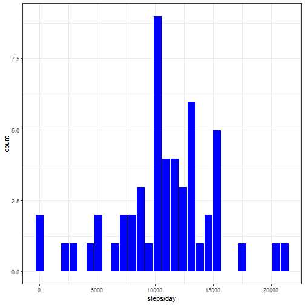
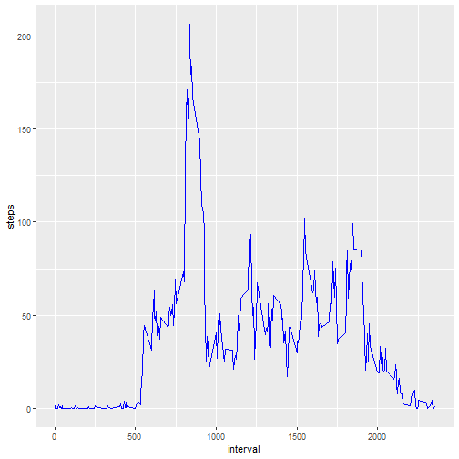
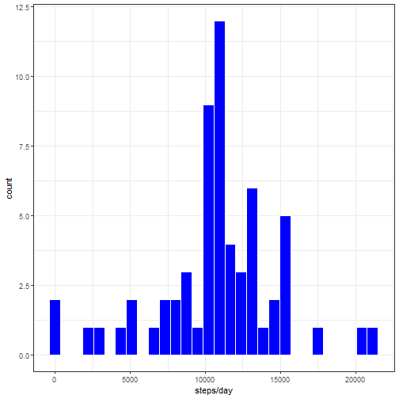

---
title: "Rep Res. document"
output:
  output: html_document
  keep_md: true
  ---

This assignment makes use of data from a personal activity monitoring device. This device collects data at 5 minute intervals through out the day. The data consists of two months of data from an anonymous individual collected during the months of October and November, 2012 and include the number of steps taken in 5 minute intervals each day.


_______________________

loading the data


```r
myurl<- "https://d396qusza40orc.cloudfront.net/repdata%2Fdata%2Factivity.zip"
download.file(myurl, paste(getwd(), "data.zip", sep = "/"))
unzip("data.zip")
activity<- read.csv("activity.csv")
```

Processing the data for first question


```r
library(ggplot2)
```

```
## RStudio Community is a great place to get help:
## https://community.rstudio.com/c/tidyverse.
```

```r
library(dplyr)
```

```
## 
## Attaching package: 'dplyr'
```

```
## The following objects are masked from 'package:stats':
## 
##     filter, lag
```

```
## The following objects are masked from 'package:base':
## 
##     intersect, setdiff, setequal, union
```

```r
t1<- aggregate(steps~date, activity, sum)
```

Histogram of the total number of steps taken each day


```r
g<- ggplot(t1, aes(t1$steps))
g+geom_histogram(fill="blue", color= "white")+ labs(x = "steps/day", y= "count")+theme_bw()
```

```
## `stat_bin()` using `bins = 30`. Pick better value with `binwidth`.
```



Mean and median number of steps taken each day


```r
mean(t1$steps)
```

```
## [1] 10766.19
```

Median


```r
median(t1$steps)
```

```
## [1] 10765
```

Time series plot of the average number of steps taken


```r
t2<- aggregate(steps~interval, activity, mean)
g1<- ggplot(t2, aes(interval, steps))
g1+geom_line(color ="blue")
```



The 5-minute interval that, on average, contains the maximum number of steps


```r
t2$interval[which(max(t2$steps)== t2$steps)]
```

```
## [1] 835
```

```r
sum(is.na(activity$steps))
```

```
## [1] 2304
```

Code to describe and show a strategy for imputing missing data:-

The missing date is being imputed by avg. number of steps for that interval. For that a new merged data set is created and a for loop used to impute the data.


```r
t2<- rename(t2, "avgsteps" = "steps")
activitynew<- merge(activity, t2, all = TRUE)
for (i in 1:length(activitynew$steps)) {
  if (is.na(activitynew$steps)[i]== TRUE) {
    activitynew$steps[i]<- activitynew$avgsteps[i]
    i= i+1
  } else {i = i+1}}
```

Histogram of the total number of steps taken each day after missing values are imputed


```r
t1<- aggregate(steps~date, activitynew, sum)
g<- ggplot(t1, aes(t1$steps))
g+geom_histogram(fill="blue", color= "white")+ labs(x = "steps/day", y= "count")+theme_bw()
```

```
## `stat_bin()` using `bins = 30`. Pick better value with `binwidth`.
```



Panel plot comparing the average number of steps taken per 5-minute interval across weekdays and weekends


```r
activitynew$date<- as.Date(activitynew$date, "%Y-%m-%d")
activitynew$Week<- ifelse(weekdays(activitynew$date)== "Sunday"|weekdays(activitynew$date)== "Saturday", "weekend", "weekday")
t3<-aggregate(steps~interval+Week, activitynew, mean)
g1<- ggplot(t3, aes(interval, steps))
g1+geom_line()+facet_grid(Week~.)
```


